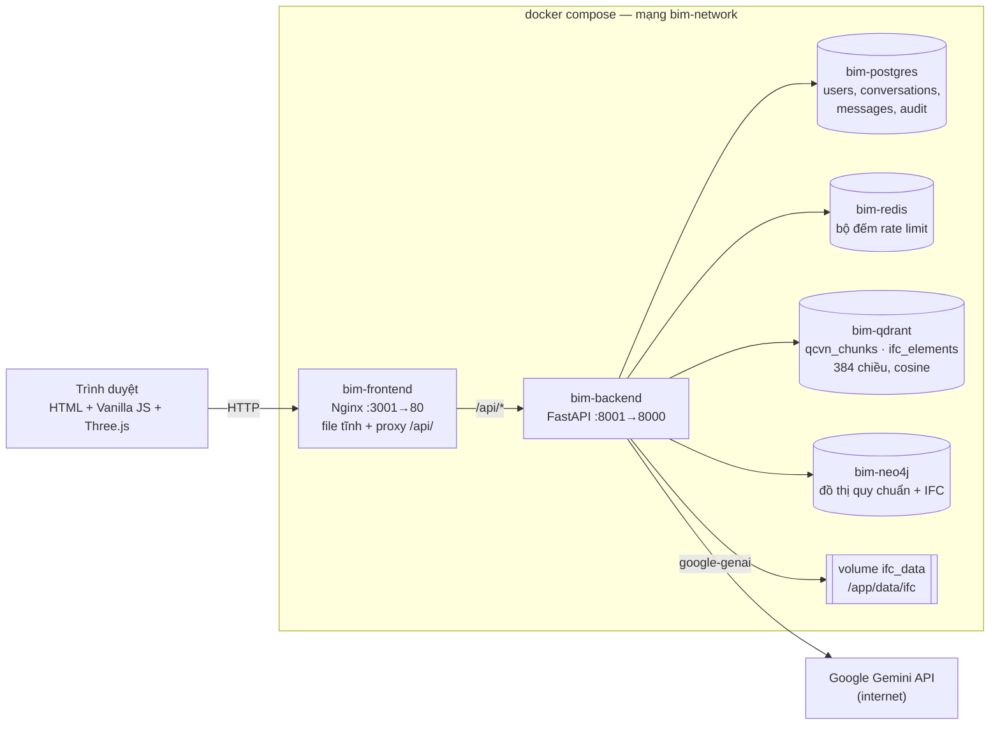
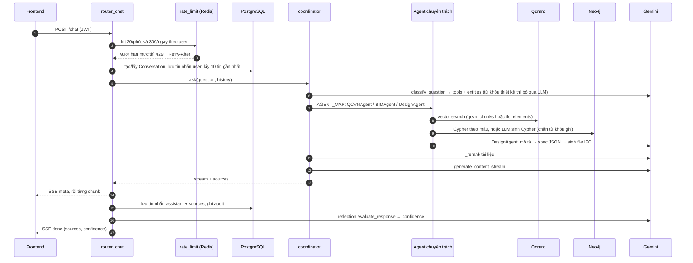
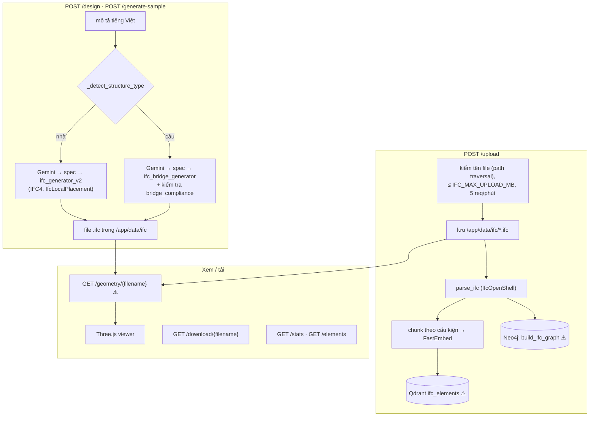
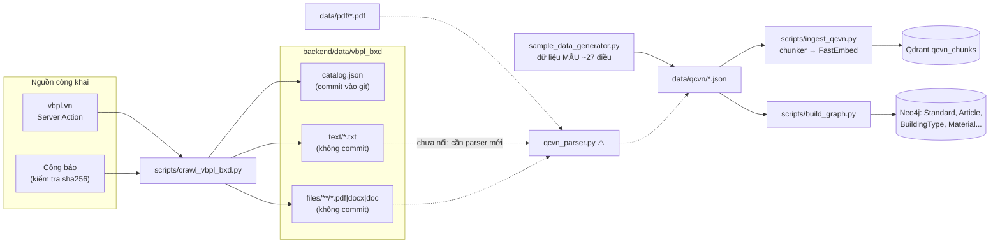
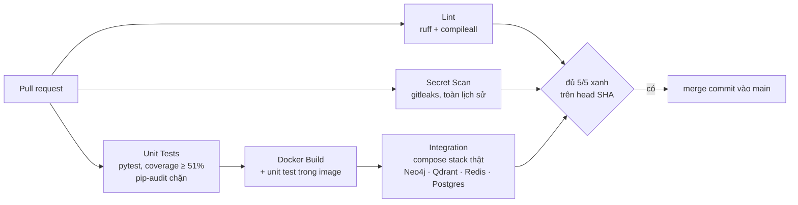

# Kiến trúc BIM AI Agent — cách hệ thống đang chạy (as-is)

> Mô tả **code hiện có trên `main`** (cập nhật 2026-10-07, sau PR #10), không phải kiến trúc mục tiêu.
> Lộ trình và việc tiếp theo: `.agent/PROGRESS.md` (file cục bộ). Khi một PR đổi luồng nào dưới đây, cập nhật file này **trong cùng PR**.
> Ký hiệu: nét đứt `-.->` = chưa nối / dự kiến; ⚠️ = lỗi hoặc giới hạn đã biết (mục 7).

## 1. Tổng quan triển khai (`docker-compose.yml`)

- Embedding chạy **trong backend** (FastEmbed `paraphrase-multilingual-MiniLM-L12-v2`, ghim `fastembed==0.4.1`), không gọi API ngoài.
- Router: `/api/v1/health`, `/api/v1/auth/*`, `/api/v1/chat` + `/conversations`, `/api/v1/documents`, `/api/v1/graph/*`, `/api/v1/ifc/*` (đăng ký trong `backend/src/main.py`).

## 2. Luồng chat — `POST /api/v1/chat` (SSE)

`AGENT_MODE` chọn bộ điều phối: **`multi_agent` (mặc định)** → `agents/coordinator.py`; `langgraph` → `rag/agent.py` (tên cũ, không dùng LangGraph); `simple` → `rag/graph_rag.py`.

| Intent (classifier) | Agent | Truy hồi |
|---|---|---|
| `qcvn_search`, `graph_reasoning`, `material_check` | `QCVNAgent` | Qdrant `qcvn_chunks` + Neo4j |
| `ifc_query` | `BIMAgent` | Qdrant `ifc_elements` + `qcvn_chunks` |
| `design_building` | `DesignAgent` | `rag/tools/design_tool.py` → nhà hoặc cầu |
| `general_chat` | — | trả lời thẳng, không truy hồi |

## 3. Luồng IFC / BIM — `/api/v1/ifc/*`

Hàm xuất móng sang JSON cho PLAXIS 3D có trong `ifc_bridge_generator.py` nhưng chưa có endpoint riêng.

## 4. Pipeline dữ liệu quy chuẩn (script chạy tay)

- **Hiện tại chatbot trả lời từ dữ liệu mẫu** (`data/qcvn/*.json`). Dữ liệu thật đã tải (51 QCVN, `catalog.json`) **chưa được nạp**. Việc tiếp theo là viết parser cho thư mục `data/vbpl_bxd`.
- `ingest_qcvn.py` và `build_graph.py` tự sinh dữ liệu mẫu nếu thư mục rỗng.

## 5. CI/CD — `.github/workflows/ci.yml` (mọi PR vào `main`, push `main`/`develop`)

## 6. Bản đồ module `backend/src`

| Thư mục | Vai trò | File chính |
|---|---|---|
| `api/` | HTTP, xác thực, rate limit, SSE | `router_chat.py`, `router_ifc.py`, `router_auth.py`, `router_graph.py` |
| `agents/` | Bộ điều phối đa agent (mặc định) | `coordinator.py`, `qcvn_agent.py`, `bim_agent.py`, `design_agent.py` |
| `rag/` | Classifier + tools, GraphRAG đơn giản, rerank, reflection, kiểm tra tuân thủ | `agent.py`, `graph_rag.py`, `tools/*`, `reflection.py`, `compliance_checker.py`, `bridge_compliance.py` |
| `knowledge_graph/` | Neo4j: driver, schema, truy vấn mẫu, LLM sinh Cypher có kiểm tra | `neo4j_client.py`, `graph_builder.py`, `graph_query_generator.py`, `ifc_to_graph.py` |
| `embeddings/` | FastEmbed + Qdrant | `embedding_service.py`, `vector_store.py` |
| `data_pipeline/` | Parse QCVN/IFC, sinh IFC nhà/cầu, chunk | `qcvn_parser.py`, `ifc_parser.py`, `ifc_generator_v2.py`, `ifc_bridge_generator.py`, `chunker.py` |
| `core/` | Config, JWT/RBAC, lỗi, rate limit, audit, logging, client LLM | `config.py`, `security.py`, `rate_limit.py`, `errors.py`, `llm.py` |
| `database/` | SQLAlchemy models + session (bảng tạo bằng `create_all`, chưa dùng Alembic) | `models.py`, `session.py` |

Ngoài `src`: `backend/scripts/` (crawl, ingest, build_graph, set_role), `backend/tests/{unit,integration,smoke}`, `frontend/` (Nginx + `js/{app,api,auth,graph,ifc-upload}.js`).

## 7. Lỗi / giới hạn đã biết (⚠️ trong sơ đồ)

| Vị trí | Vấn đề |
|---|---|
| `vector_store.upsert_chunks` | Point id = số thứ tự (`id=i`) → upload IFC sau **ghi đè** vector của file trước; nạp lại để sót điểm rác |
| `ifc_to_graph.py` | `Storey.name` UNIQUE → "Tầng 1" của mọi tòa nhà gộp làm một node |
| `qcvn_parser.py` | Chỉ nhận "Chương/Điều", QCVN thật đánh số `x.y.z` → giữ ~1,5% nội dung; regex đơn vị `m` khớp cả `mm` |
| `router_ifc.py` | `GET /geometry/{filename}` khai báo **2 lần** — chỉ route đầu có hiệu lực |
| 3 bộ điều phối | `coordinator.py`, `rag/agent.py`, `rag/graph_rag.py` trùng chức năng; `SYSTEM_PROMPT` của agent không được dùng khi sinh câu trả lời |
| `/health` | Trả 200 cả khi một dịch vụ "degraded" |
